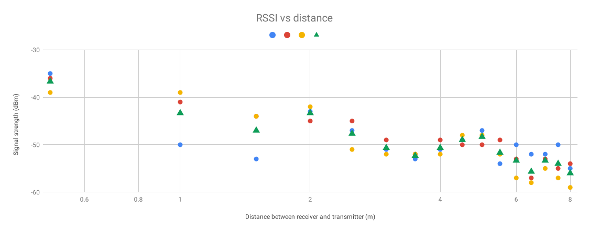

# sensornetworks
lab1

### Signal Variability

We found the signal to vary significantly with minor variations in the surrounding environment. 
- A wooden door at 1Mand detector at 2M realized an attenuation of 5dB.
- A person sitting at 1M and detector placed at 2M realized an attenuation of ~3dB, only when the transmitter was perfectly blocked.  
- Numerous orientations had a varying degree of attenuation. The phone placed flat achieved -43dB signal strength, vertically it achieved -45dB and horizontally it achieved -50dB. 

The challenge with obtaining a perfect representation of these signals is the fact that there is human interaction, particularly in the case of phone orientation when a person has to hold the device and can block/interfere the signal.

### Path Loss

Below you can see a figure of signal strength as a function of distance. The experiment was then repeated three times and the data is visible in the graph. Each distance was not repeatedly measured to avoid autocorrelation.

 

