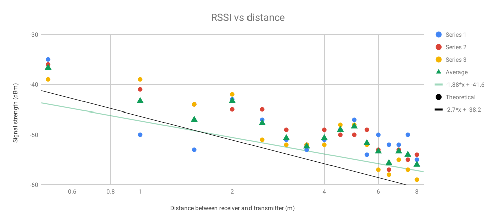

# sensornetworks

### Signal Variability

We found the signal to vary significantly with minor variations in the surrounding environment. 
- A wooden door at 1Mand detector at 2M realized an attenuation of 5dB.
- A person sitting at 1M and detector placed at 2M realized an attenuation of ~3dB, only when the transmitter was perfectly blocked.  
- Numerous orientations had a varying degree of attenuation. The phone placed flat achieved -43dB signal strength, vertically it achieved -45dB and horizontally it achieved -50dB. 

The challenge with obtaining a perfect representation of these signals is the fact that there is human interaction, particularly in the case of phone orientation when a person has to hold the device and can block/interfere the signal.

### Path Loss

Below you can see a figure of signal strength as a function of distance. The experiment was then repeated three times and the data is visible in the graph below. Each distance was not repeatedly measured to avoid autocorrelation. The green triangles series shows the average of the three measured series along with least-squares trendline. The black line is added for comparison of the slope to the theoretical model

Theoretically, the signal should decrease proportionally to the distance squared, however, there are reflections from walls, floor, ceiling, people and objects in the room. This caused variations in the signal, some of them are consistent between different series which implies it was caused by the geometry of the room. The differences between different runs are most likely caused by the moving people, different phone placement and vvariation in the transmitted signal.

### Horus on synthetic data

  

