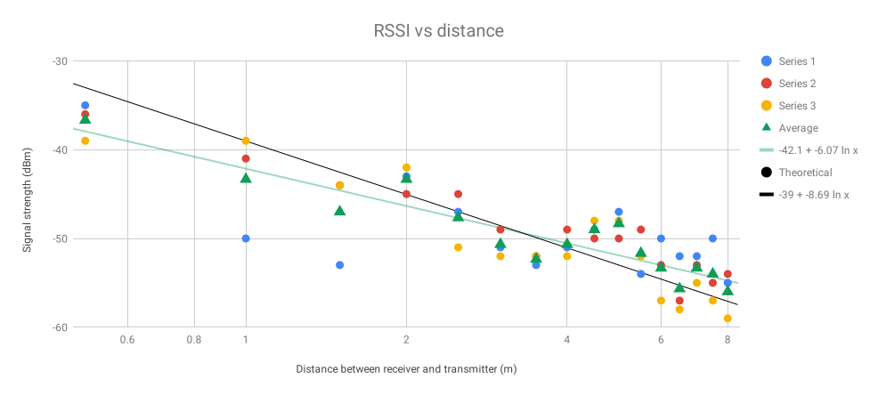

# Sensor Networks Lab

### Signal Variability

We noticed that the signal changes significantly with minor variations in the surrounding environment. For example,

- A wooden door at 1m and detector at 2m realized an attenuation of 5dB.

- A person sitting at 1m and detector placed at 2m realized an attenuation of ~3dB, only when the transmitter was perfectly blocked.  

- Numerous orientations had a varying degree of attenuation. The phone placed flat achieved -43dB signal strength, vertically it achieved -45dB and horizontally it achieved -50dB. 

The challenge with obtaining a perfect representation of these signals is the fact that there is human interaction, particularly in the case of phone orientation due to a person having to hold the device.

### Path Loss

The figure below illustrates signal strength as a function of log distance. Measurements of RSSI were recorded at distances from 0.5m to 8m at 0.5m intervals. This entire procedure was repeated 3 times as opposed to measuring 3 samples at one position in a small time frame which would have introduced autocorrelation. The green triangle series shows the average of the three measured series along with a least-squares trendline. The black line is added for comparison of the slope to the theoretical model

Theoretically, the signal should decrease proportionally to the distance squared, however, there are reflections from the walls, floor, ceiling, people and objects in the room. In reality, the signal days slightly slower than the theoritical model. This caused variations in the signal, some of them are consistent between different series which implies it was caused by the geometry of the room. The differences between different runs are most likely caused by the moving people, different phone placement and variation in the transmitted signal.

### Horus on synthetic data

RSS Distribution

The signal variation is modelled as a Gaussian distribution. Gassian distributions are a good choice as several of the sources for the signal variation (thermal noise on the transmitter and receiver, air composition and density on the path, etc) can be modelled as Gaussian noise. Hence, the overall variation is Gaussian as well. Each source at each location results in a gaussian with a mean and standard deviation. Using this information, we can compute the log likelihood of a test point against this gaussian and sum the losses across access points at a given location. For example, if we have 63 fixed training locations, we will have 63 losses. We can feed these losses through a softmax to obtain probabilities. We can then use all these probabilities or the top K to weight the positions and obtain an expected position.

### Location Estimation

#### Set 1 : 3 AP's

Top 1 Probability Results

Top 5 Probability Results

Top 10 Probability Results

Note that the top probability picks a single point in the training set as the best option. As a result, all the predicted points lie on top of the original training grid points. This did not seem realistic which is why we introduced top K probabilities. The aim of this approach was to weight the positions by the probability of being in each of the positions in order to obtain an expected position. This approach leads to a smoother graph with (x,y) points that are not directly on the grid. However, this leads to a higher average error as can be seen in the figures on the RHS.

#### Set 2 : 5 AP's

Top 1 Probability Results

Top 5 Probability Results

Top 10 Probability Results

Adding AP's does appear to improve predictions with better test point mapping in the lower left corner. However, the addition of top K does not appear to significantly influence the comparative performance.

### Fingerprint on Real Data

In this section we simply use our top K approach of Horus to model the real dataset. We find that we can achieve a low error term by picking enough probabilities from the positions. 

Above we have plotted our predictions for the locations where we expect our test points to be. Around each point we also have a radius which includes the errors from the true value.

The results show that the test points have an average error of 1.87 m and the training points have 1.61 m error. 

