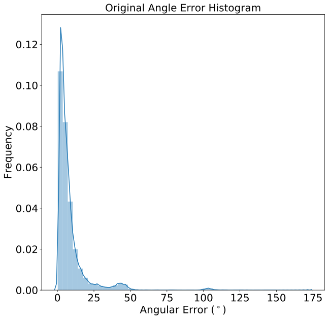

#Vision Based Positioning

### Data Collection

### Turtlebot
It is important to synchronise the turtlebot time with the time of the cameras. That allows us to later compare the predicted motion data with the real data. A visual or sound signal could be used to syncronise the streams, similar to clapperboards that are used in movies. Also, when the devices are connected to the internet, NTP could be used to synchronise both streams with respect to UTC.

