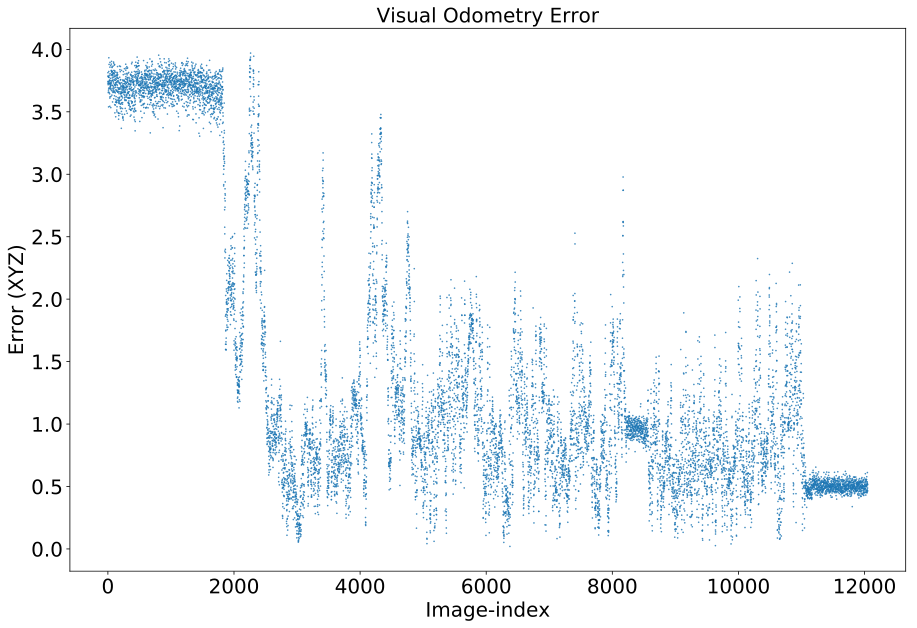

# Vision Based Positioning

### Data Collection

In order to determine the accuracy of PoseNet at determining the position of the turtlebot, a ground truth value had to be determined. This was done using a VICON object tracking system. To verify this system's measurements are accurate enough to be considered a ground truth, preliminary experiments were conducted. Specifically, a sensor was placed along a tape measure at regular intervals of 50 cm and the position estimation of the VICON system was observed. The estimated position of the sensor  varying with time is shown below.

For an completely accurate sensor tracking system, we would expect the differences in the height of the plateaus in the graph above to be 50 cm. These values from the VICON system are shown below.

As expected the VICON system appears to be very accurate, with a mean error of less than a milimeter. In reality the error could be even lower as we would expect roughly the same level of precision from placing the sensor.

### Turtlebot
It is important to synchronise the turtlebot time with the time of the cameras. This allows us to later compare the predicted motion data with the real data. A visual or sound signal could be used to synchronise the streams, similar to clapperboards that are used in movies. Also, when the devices are connected to the internet, NTP could be used to synchronise both streams with respect to UTC.

|Error| Mean | Median | Min | Max | 
|------|------  |------  |------  |------  |
|   Translation |  1.423 | 0.974 | 0.02 | 3.97 |
|   Rotation |  26 | 11 | 0.2 | 180|

|Error| Mean | Median | Min | Max | 
|------|------  |------  |------  |------  |
|   Translation |  0.706 | 0.595 | 0.01 | 4.40 |
|   Rotation |  8.59 | 5.08 | 0.2 | 171|

Images that gave the smallest error in position prediction

|  |  |  |
|:--:|:--:|:--:| 
| *6376* |*9635*|*9883*|

|  |  |  |
|:--:|:--:|:--:| 
| *2263* |*806*|*2313*|

