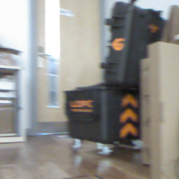

# Vision Based Positioning

### Data Collection

In order to determine the accuracy of PoseNet at determining the position of the turtlebot, a ground truth value had to be determined. This was done using a VICON object tracking system. To verify this system's measurements are accurate enough to be considered a ground truth, preliminary experiments were conducted. Specifically, a sensor was placed along a tape measure at regular intervals of 50 cm and the position estimation of the VICON system was observed. The estimated position of the sensor  varying with time is shown below.

For an completely accurate sensor tracking system, we would expect the differences in the height of the plateaus in the graph above to be 50 cm. These values from the VICON system are shown below.

As expected the VICON system appears to be very accurate, with a mean error of less than a milimeter. In reality the error could be even lower as we would expect roughly the same level of precision from placing the sensor.

### Turtlebot
It is important to synchronise the turtlebot time with the time of the cameras. This allows us to later compare the predicted motion data with the real data. A visual or sound signal could be used to synchronise the streams, similar to clapperboards that are used in movies. Also, when the devices are connected to the internet, NTP could be used to synchronise both streams with respect to UTC.

The results of our experiment for visual odometry:

|Error| Mean | Median | Min | Max | 
|------|------  |------  |------  |------  |
|   Translation |  1.423 | 0.974 | 0.02 | 3.97 |
|   Rotation |  26 | 11 | 0.2 | 180|

The results of the original test dataset:

|Error| Mean | Median | Min | Max | 
|------|------  |------  |------  |------  |
|   Translation |  0.706 | 0.595 | 0.01 | 4.40 |
|   Rotation |  8.59 | 5.08 | 0.2 | 171|

The histogram of the postion errors has two distinctive peaks. The second peak is caused by the images which were recorded at the robot's intial position. The rest of the distribution follows Maxwell-Boltzmann distribution, which shows the expected vector length, given its components are random independent Gaussian variables. 

### Visual odometry accuracy discussion

The images which give the largest and smallest error in prediction are shown below. We can see that the images with the largest error all have the other robot in frame which may have moved since when the network was trained. We can also see that the majority of the background of the image is blank walls. This is difficult to extract features from which allow unique identification of position. By contrast, the images with the smallest error had several distinct, permenant objects taking up the majority of the frame. The paper mentions that the network is highly sensitive to large textureless areas such as floor or blank walls.

Large errors in rotation are caused by symmetric environments and also by the camera being in a slightly different position to when the network is trained. It is also important to ensure that the VICON marker has the same location and rotation relevant to robot's camera in training and testing.

Images that gave the smallest error in position prediction

|  |  |  |
|:--:|:--:|:--:| 
| *6376* |*9635*|*9883*|

Images that gave the largest error in position prediction:

|  |  |  |
|:--:|:--:|:--:| 
| *2263* |*806*|*2313*|

To improve the performance of visual odometry, we could add additional cameras to the robot to predict the position of both of them. Alternatively, we could add wheel odometry or gyroscopic data to the model as well. Another improvement would also consider that the successive  images are correlated as the robot is moving at finite speed. This property could be leveraged by using a Kalman filter on the outputs of the network or alternatively by using an architecture such as a recurrent neural network. 

### Wheel odometry

The above figure shows location estimation of the VICON system compared with that inferred from the robot's accelerometer (wheel odometry). As expected the two trajectories have very similar shapes although we notice some drift from the VICON data in the wheel odometry. This is because we are not measuring position directly and instead have to integrate over measured accelerations. As such small errors in these measurements will accumulate as time increases. This could be caused due to the wheels slipping, irregular terrain or calibration errors in the accelerometer.